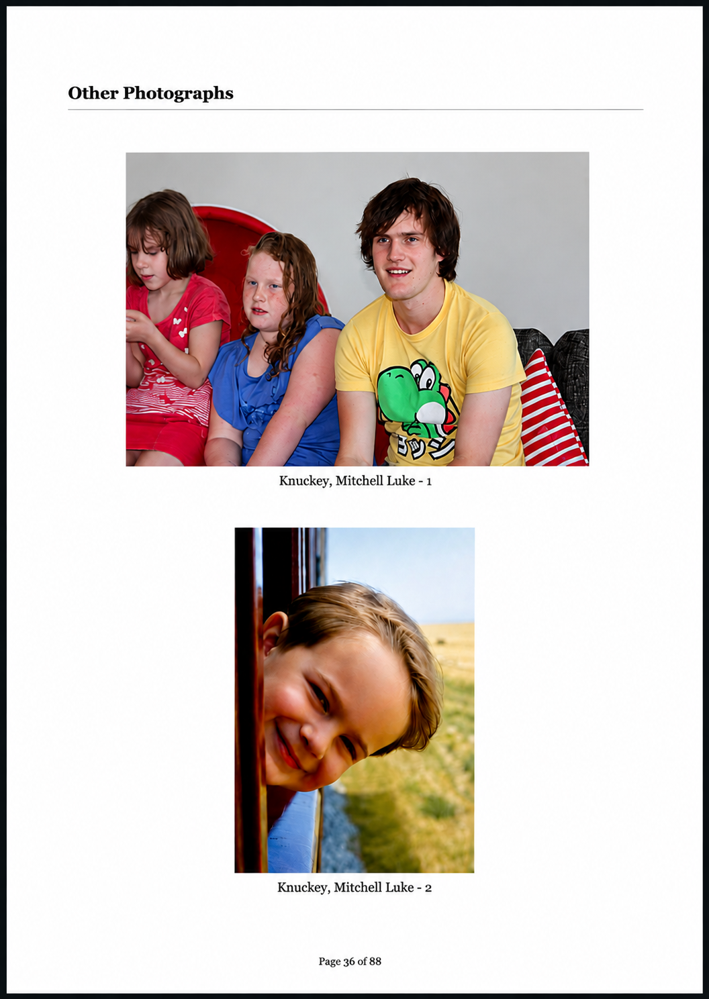

# FFD 2.0 RC1.0.9 — Final Image Page Layout Specification

This document freezes the accepted Family History Book photograph-page presentation for RC1.0.9.

## Canonical layout

The accepted layout is the visual reference above. The implementation requirements are:

- Two photographs per photograph page, vertically stacked.
- The two-photo group is centred visually within the printable page area, with a modest downward offset beneath the page heading.
- Each photograph is centred horizontally on the full printable page width.
- Landscape photographs retain the successful 91 mm maximum-height allowance.
- Portrait and square photographs retain the successful 106 mm maximum-height allowance.
- Original aspect ratio is always preserved.
- `object-fit: contain` is mandatory; photographs must never be cropped to fill a frame.
- Each caption remains directly beneath its photograph, centred, fully visible, and outside the image area.
- The `Other Photographs` heading and rule remain at the top of the first photograph page and do not influence the horizontal alignment of photographs.
- Preferred/hero-photo semantics and certificate/document rendering are independent of this page layout and must not regress.
- Obsolete “Open original” links do not appear in published photograph/document pages.

## Vertical group position

The established image sizes and individual horizontal positions are frozen. The final layout moves the complete two-photo group down by **8 mm** using a visual translation that does not alter pagination geometry. This preserves the accepted image sizes while balancing the group more naturally between the heading and page footer.
